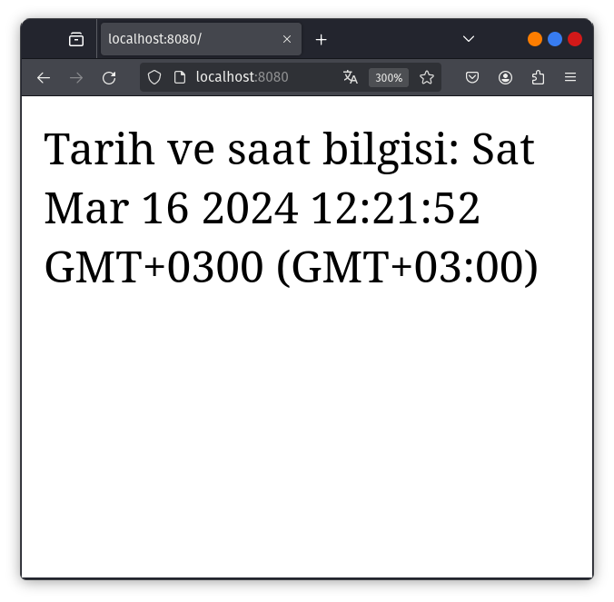
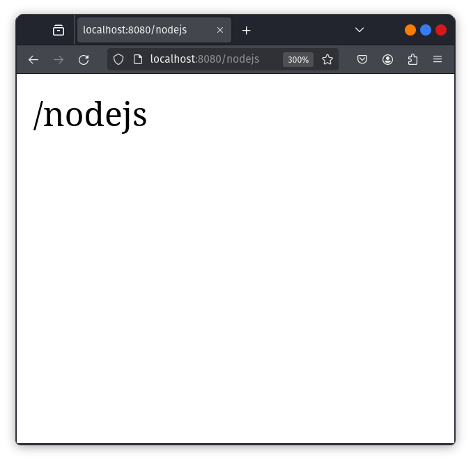
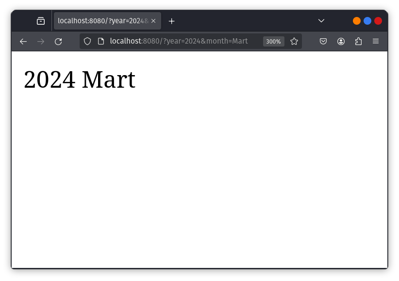
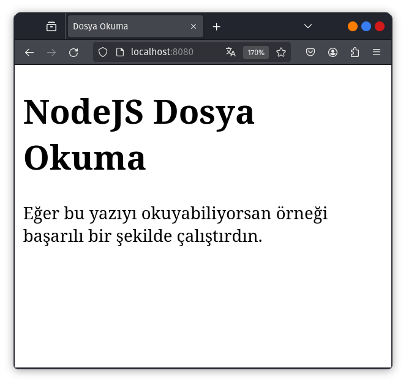

<style>
 .center {
  display: block;
  margin-left: auto;
  margin-right: auto;
  width: 50%;
}
</style>

# ***Hazırlık***
<hr>

Döküman boyunca terminalden çalıştırmamız gereken komutlar olacak. Dosya karmaşasını önlemek adına kullanıcı klasorünün içerisine "NodeJS" adlı dizin oluşturup çalışmalarımızı bu dizin üzerinde yürüteceğiz. Bu işlemi terminal üzerinden yapmanızı öneriyorum.

```powershell
# Windows Powershell
PS C:\Users\kullanıcı> mkdir NodeJS
PS C:\Users\kullanıcı> cd NodeJS
PS C:\Users\kullanıcı\NodeJS>
```

```bash
# Linux Bash
kullanıcı@localhost:~> mkdir NodeJS
kullanıcı@localhost:~> cd NodeJS
kullanıcı@localhost:~/NodeJS>
```

**Bu noktadan sonra tüm komutları bu dizin içerisinden çalıştıracağız! Dökümanda da çalıştırmamız gereken komutlar bu kurala göre yazılmıştır!**

Komutlar hem Powershell, hem de bash için ayrı olarak verilecek. 
<hr>
<hr>

# **NodeJS'e Giriş**

<hr>

NodeJS, Google tarafından C++ ile yazılmış V8 JavaScript motoru üzerine inşa edilmiş bir JavaScript runtime'dır. Peki neden NodeJS:

- Açık kaynak olduğundan arkasında büyük bir topluluk ve geliştirici desteği vardır.
- Asenkron programlama mantığını kullanır.
- Server'da dosya yaratma, okuma, yazma, silme gibi işlemleri gerçekleştirir.
- Form verilerini toplar.
- Veritabanına veriyi ekler, siler ya da düzenler.

NodeJS, belli event koşulları sağlandığında çalışacak göreve ait kod dizisini içerir. Tipik bir event, client'ın sunucudaki bir porta erişmeye çalışması olarak tanımlanabilir. 

NodeJS dosyaları ".js" uzantılıdır ve bu dosyalar, herhangi bir etki söz konusu olmadan önce sunucuda başlatılmalıdır.

<hr>
<hr>

# **NodeJS Programlamaya Başlangıç**
<hr>

Bir NodeJS uygulaması programlamadan önce NodeJS'i sistemimize kurmamız gerekmektedir ([NodeJS resmi sitesine gider.](https://nodejs.org/)). Kurulum sonrası sistemimizde NodeJS programlamaya başlayabilirir.

```powershell
# Windowsun paket yöneticisi olan winget'i kullanarak krulumu gerçekleştirebiliriz
PS C:\Users\kullanıcı\NodeJS> winget install -e --id OpenJS.NodeJS
```
```bash
# Dökümantasyonda Fedora Linux baz alınacaktır. Dolayısıyla dnf paket yöneticisi kullanılacak
kullanıcı@localhost:~/NodeJS> sudo dnf install nodejs nodejs-npm
```

İlk örneğimiz web tarayıcısında "Web dersinde NodeJS öğreniyoruz!" yazdırma. 

"ilkörnek" isimli bir dizin açalım ve içerisinde ilkmodül.js uzantılı bir dosya oluşturup şu kodları yazalım:

```javascript
var http = require('http');

http.createServer(function (req, res) {
    res.writeHead(200, {'Content-Type': 'text/html'});
    res.end('Web dersinde NodeJS ogreniyoruz!');
}).listen(8080); 
```

Yazdığımız bu koda ait detaylara az sonra değineceğiz.Bu kodu çalıştırmak için NodeJS kodumuzun bulunduğu dizinde şu komutu yazıyoruz:


```powershell
PS C:\Users\kullanıcı\NodeJS> node ilkörnek\ilknode.js
```

```bash
kullanıcı@localhost:~/NodeJS> node ilkörnek/ilknode.js
```

Bu komutu çalıştırdıktan sonra da tarayıcıdan http://localhost:8080 adresini açın.


Eğer çıktı olarak bu ekranı görüyorsak ilk örneğimizi başarılı bir şekilde gerçekleştirmişizdir. 

<hr>
<hr>

# **NodeJS Modülleri**

<hr>

İlk örneğimizde NodeJS ile birlikte dahili olarak gelen http modülünü kullandık. Şimdi ise kendi modülümü oluşturup kullanacağız.

"ilkmodül" isminde bir dizin oluşturup içinde "ilk_modül.js" ve "ilk_modül_demo.js" isimli dosyalar oluşturalım. Gerekli dosya ve dizinleri oluşturduktan sonra kendi modülümüzü "ilk_modül.js" dosyasının içinde oluşturabilir.

```javascript
// Tarih ve saat bilgisi döndüren modül
exports.currentDateTime = function () {
    return Date();
}; 
```

Modülümüzü oluşturduktan sonra sıra bu modülün kullanılmasına geliyor. Bunun için de "ilk_modül_demo.js" dosyamızı düzenliyoruz.

```javascript
var http = require('http');
var dt = require('./ilkmodül');

http.createServer(function (req, res) {
    res.writeHead(200, {'Content-Type': 'text/html'});
    res.write("The date and time are currently: " + dt.currentDateTime());
    res.end();
}).listen(8080); 
```

Kodlarımız çalıştırılmaya hazır. ilk_modül_demo.js dosyasını node ile çalıştırım aldığımız çıktıyı kontrol edelim.

```powershell
PS C:\Users\kullanıcı\NodeJS> node ilkmodül\ilk_modül_demo.js
```

```bash
kullanıcı@localhost:~/NodeJS> node ilkmodül/ilk_modül_demo.js
```



<hr>
<hr>

# **NodeJS HTTP Modülü**

http.createServer(), içerisinde tanımlanan fonksiyona ait ```req``` isminde bağımsır bir değişken kapsar. ```req```, istemciden gelen request'i yani isteği bir http.IncomingMessage nesnesi olarak temsil eder.

sorgu isminde bir dizin oluşturalım ve içine sorgu.js isimli bir dosya oluşturalım. Sonrasında şu kodları ekleyelim

```javascript
var http = require('http');

http.createServer(function (req, res) {
    res.writeHead(200, {'Content-Type': 'text/html'});
    res.write(req.url); // URL domain sonrası okuma bu satırda gerçekleşir.
    res.end();
}).listen(8080);
```

Sonrasında örneğimizi çalıştıralım

```powershell
PS C:\Users\kullanıcı\NodeJS> node sorgu\sorgu.js
```

```bash
kullanıcı@localhost:~/NodeJS> node sorgu/sorgu.js
```

Yerel sunucumuz aktif. Tarayıcıya [localhost:8080/nodejs](localhost:8080/nodejs) yazıp kodumuzu test edelim.



URL üzerinden daya oknabilir veriler de çekebiliriz. okunaklı_sorgu dizini açalım ve aynı isimde bir .js dosyası oluşturalım.

```javascript
var http = require('http');
var url = require('url'); // URL isimli modülü aktifleştirir.

http.createServer(function (req, res) {
    res.writeHead(200, {'Content-Type': 'text/html'});
    var q = url.parse(req.url, true).query; 
    // Sorgu parametreleri ayrıştırılarak JS nesnesi olarak saklanır
    var txt = q.year + " " + q.month; 
    // Sorguda ayrıştırılan year ve month özelliklerini içeren q nesnesi kullanarak bir metin oluşturulur.
    res.end(txt);
}).listen(8080);
```

Sunucumuzu aktifleştirip tarayıcımızdan [localhost:8080/?year=2024&month=Mart](localhost:8080/?year=2024&month=Mart) adresine gidelim.

```powershell
PS C:\Users\kullanıcı\NodeJS> node okunaklı_sorgu\okunaklı_sorgu.js
```

```bash
kullanıcı@localhost:~/NodeJS> node okunaklı_sorgu/okunaklı_sorgu.js
```



# **NodeJS File System Modülü**

NodeJS ile dosya sistemi üzerinde çalışmalar yürütmek için ```var fs = require('fs');``` kod satırını NodeJS kodumuza dahil edebiliriz. Bu modül bize dosyaları okuma, oluşturma, düzenleme, silme ve yeniden adlandırma işlevlerini sağlar.

## **1. Dosya Okuma**

okuma isminde bir dizin açalım ve içine okunacak.html isimli bir dosya oluşturalım.

```html
<!DOCTYPE html>
<html>
    <head>
        <title>Dosya Okuma</title>
        <meta charset="utf-8">
    </head>
    <body>
        <h1>NodeJS Dosya Okuma</h1>
        <p>Eğer bu yazıyı okuyabiliyorsan örneği 
        başarılı bir şekilde çalıştırdın.</p>
    </body>
</html> 
```

Şimdi de okuyan.js dosyası oluşturalım

```javascript
var http = require('http');
var fs = require('fs');

http.createServer(function (req, res) {
    // okunacak.html dosyası okunmak üzere tanımlanır
    fs.readFile('okunacak.html', function(err, data) {
        res.writeHead(200, {'Content-Type': 'text/html'});
        res.write(data);
        return res.end();
    });
}).listen(8080); 
```

Sunucuyu aktifleştirip kodumuzu test edelim

```powershell
PS C:\Users\kullanıcı\NodeJS> node okuma\okuyan.js
```

```bash
kullanıcı@localhost:~/NodeJS> node okuma/okuyan.js
```



## **1. Dosya Oluşturma**

File System modülünde dosya oluşturmayla alakalı metotlar şu şekildedir:

- ```fs.appendFile()```
- ```fs.open()```
- ```fs.writeFile()```
 
 ```fs.appendFile()```, belirtilen bir içeriği dosyaya kaydeder. Dosya mevcut değilse yeni bir dosya oluşturur.

 ```javascript
 var fs = require('fs');

fs.appendFile('metin.txt', 'Hello content!', function (err) {
    if (err) throw err;
    console.log('Saved!');
}); 
 ```

