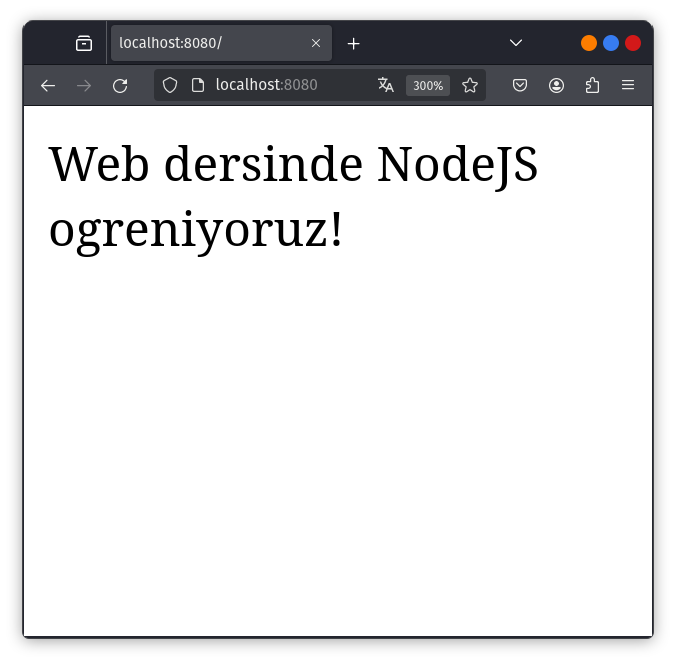
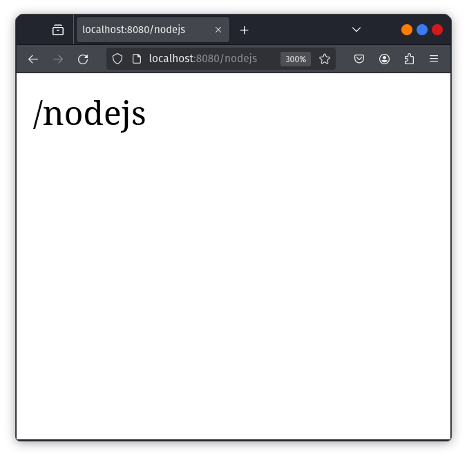
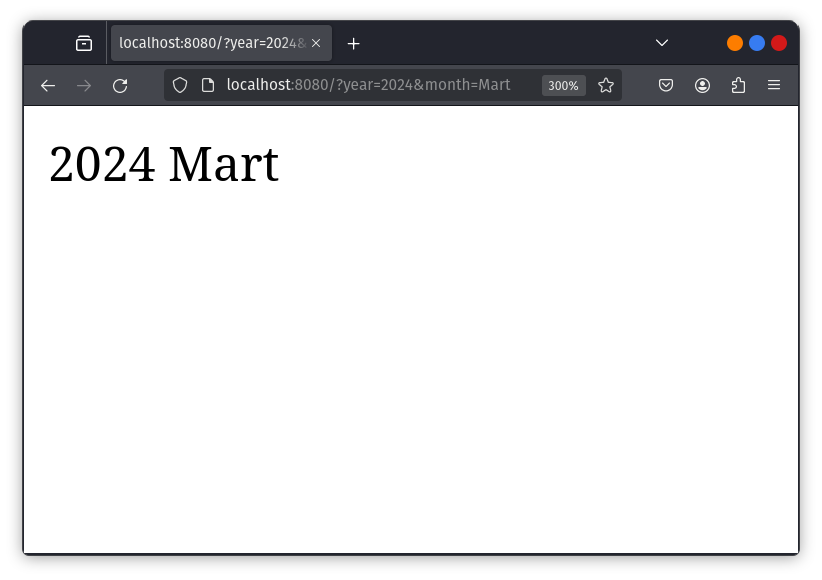
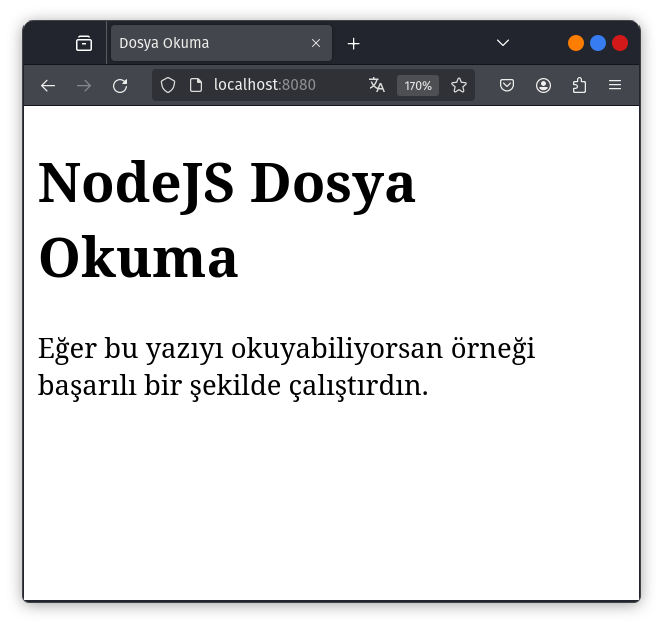
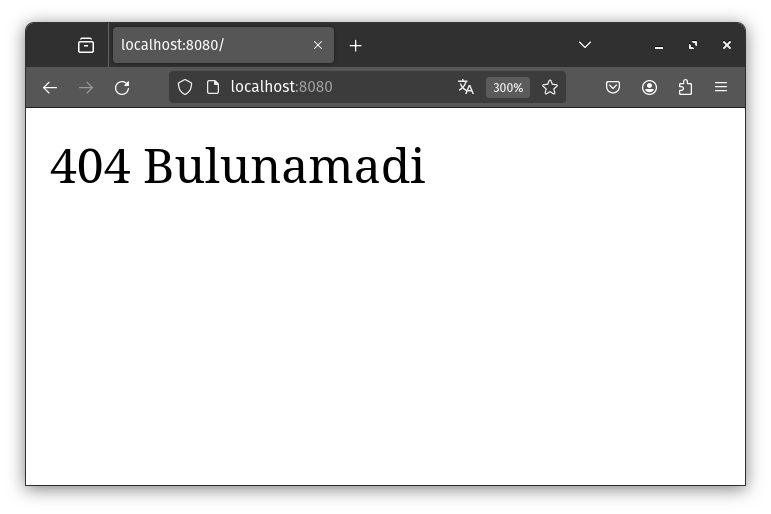
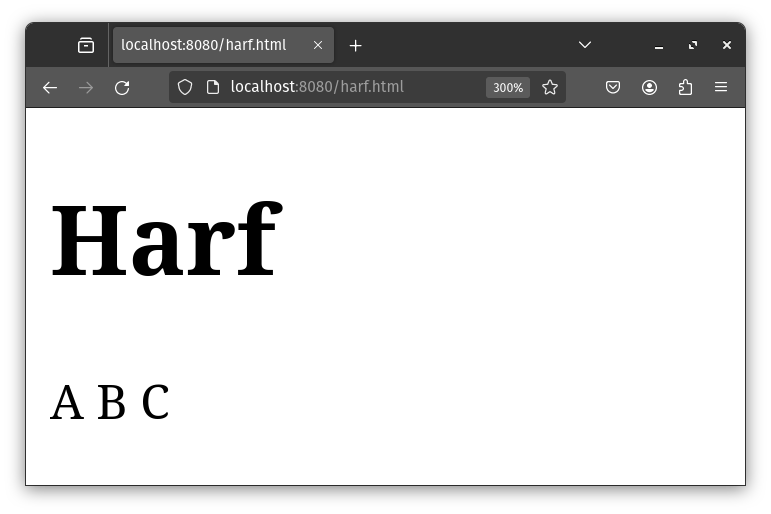
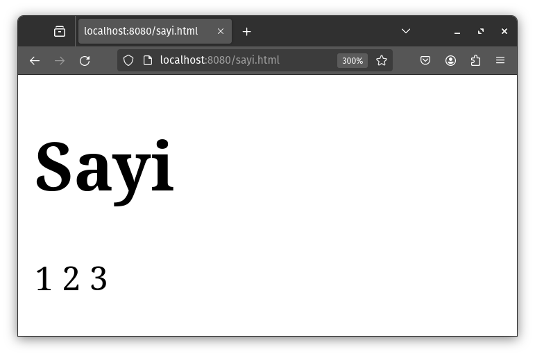
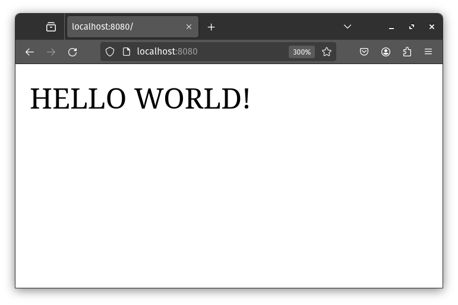

<style>
 .center {
  display: block;
  margin-left: auto;
  margin-right: auto;
  width: 50%;
}
</style>

# ***Hazırlık***
<hr>

Döküman boyunca terminalden çalıştırmamız gereken komutlar olacak. Dosya karmaşasını önlemek adına kullanıcı klasorünün içerisine "NodeJS" adlı dizin oluşturup çalışmalarımızı bu dizin üzerinde yürüteceğiz. Bu işlemi terminal üzerinden yapmanızı öneriyorum.

```powershell
# Windows Powershell
PS C:\Users\kullanıcı> mkdir NodeJS
PS C:\Users\kullanıcı> cd NodeJS
PS C:\Users\kullanıcı\NodeJS>
```

```bash
# Linux Bash
kullanıcı@localhost:~> mkdir NodeJS
kullanıcı@localhost:~> cd NodeJS
kullanıcı@localhost:~/NodeJS>
```

**Bu noktadan sonra tüm komutları bu dizin içerisinden çalıştıracağız! Dökümanda da çalıştırmamız gereken komutlar bu kurala göre yazılmıştır!**

Komutlar hem Powershell, hem de bash için ayrı olarak verilecek. 

Bu dökümanı kendi VSCode editörünüzde okunabilir kılmak için Markdown Preview Enhanced eklentisini kurunuz.

Daha akıcı bir NodeJS programlama deneyimi için de NodeJS Snippets eklentisini kurabilirsiniz.

<hr>
<hr>

# **NodeJS'e Giriş**

<hr>

NodeJS, Google tarafından C++ ile yazılmış V8 JavaScript motoru üzerine inşa edilmiş bir JavaScript runtime'dır. Peki neden NodeJS:

- Açık kaynak olduğundan arkasında büyük bir topluluk ve geliştirici desteği vardır.
- Asenkron programlama mantığını kullanır.
- Server'da dosya yaratma, okuma, yazma, silme gibi işlemleri gerçekleştirir.
- Form verilerini toplar.
- Veritabanına veriyi ekler, siler ya da düzenler.

NodeJS, belli event koşulları sağlandığında çalışacak göreve ait kod dizisini içerir. Tipik bir event, client'ın sunucudaki bir porta erişmeye çalışması olarak tanımlanabilir. 

NodeJS dosyaları ".js" uzantılıdır ve bu dosyalar, herhangi bir etki söz konusu olmadan önce sunucuda başlatılmalıdır.

<hr>
<hr>

# **NodeJS Programlamaya Başlangıç**
<hr>

Bir NodeJS uygulaması programlamadan önce NodeJS'i sistemimize kurmamız gerekmektedir ([NodeJS resmi sitesine gider.](https://nodejs.org/)). Kurulum sonrası sistemimizde NodeJS programlamaya başlayabilirir.

```powershell
# Windowsun paket yöneticisi olan winget'i kullanarak krulumu gerçekleştirebiliriz
PS C:\Users\kullanıcı\NodeJS> winget install -e --id OpenJS.NodeJS
```
```bash
# Dökümantasyonda Fedora Linux baz alınacaktır. Dolayısıyla dnf paket yöneticisi kullanılacak
kullanıcı@localhost:~/NodeJS> sudo dnf install nodejs nodejs-npm
```

İlk örneğimiz web tarayıcısında "Web dersinde NodeJS öğreniyoruz!" yazdırma. 

"ilkörnek" isimli bir dizin açalım ve içerisinde ilkmodül.js uzantılı bir dosya oluşturup şu kodları yazalım:

```javascript
var http = require('http');

http.createServer(function (req, res) {
    res.writeHead(200, {'Content-Type': 'text/html'});
    res.end('Web dersinde NodeJS ogreniyoruz!');
}).listen(8080); 
```

Yazdığımız bu koda ait detaylara az sonra değineceğiz.Bu kodu çalıştırmak için NodeJS kodumuzun bulunduğu dizinde şu komutu yazıyoruz:


```powershell
PS C:\Users\kullanıcı\NodeJS> node ilkörnek\ilknode.js
```

```bash
kullanıcı@localhost:~/NodeJS> node ilkörnek/ilknode.js
```

Bu komutu çalıştırdıktan sonra da tarayıcıdan http://localhost:8080 adresini açın.



Eğer çıktı olarak bu ekranı görüyorsak ilk örneğimizi başarılı bir şekilde gerçekleştirmişizdir. 

<hr>
<hr>

# **NodeJS Modülleri**

<hr>

İlk örneğimizde NodeJS ile birlikte dahili olarak gelen http modülünü kullandık. Şimdi ise kendi modülümü oluşturup kullanacağız.

"ilkmodül" isminde bir dizin oluşturup içinde "ilk_modül.js" ve "ilk_modül_demo.js" isimli dosyalar oluşturalım. Gerekli dosya ve dizinleri oluşturduktan sonra kendi modülümüzü "ilk_modül.js" dosyasının içinde oluşturabilir.

```javascript
// Tarih ve saat bilgisi döndüren modül
exports.currentDateTime = function () {
    return Date();
}; 
```

Modülümüzü oluşturduktan sonra sıra bu modülün kullanılmasına geliyor. Bunun için de "ilk_modül_demo.js" dosyamızı düzenliyoruz.

```javascript
var http = require('http');
var dt = require('./ilkmodül');

http.createServer(function (req, res) {
    res.writeHead(200, {'Content-Type': 'text/html'});
    res.write("The date and time are currently: " + dt.currentDateTime());
    res.end();
}).listen(8080); 
```

Kodlarımız çalıştırılmaya hazır. ilk_modül_demo.js dosyasını node ile çalıştırım aldığımız çıktıyı kontrol edelim.

```powershell
PS C:\Users\kullanıcı\NodeJS> node ilkmodül\ilk_modül_demo.js
```

```bash
kullanıcı@localhost:~/NodeJS> node ilkmodül/ilk_modül_demo.js
```


<hr>
<hr>

# **NodeJS HTTP Modülü**

```http.createServer()```, içerisinde tanımlanan fonksiyona ait ```req``` isminde bağımsır bir değişken kapsar. ```req```, istemciden gelen request'i yani isteği bir ```http.IncomingMessage``` nesnesi olarak temsil eder.

sorgu isminde bir dizin oluşturalım ve içine sorgu.js isimli bir dosya oluşturalım. Sonrasında şu kodları ekleyelim

```javascript
var http = require('http');

http.createServer(function (req, res) {
    res.writeHead(200, {'Content-Type': 'text/html'});
    res.write(req.url); // URL domain sonrası okuma bu satırda gerçekleşir.
    res.end();
}).listen(8080);
```

Sonrasında örneğimizi çalıştıralım

```powershell
PS C:\Users\kullanıcı\NodeJS> node sorgu\sorgu.js
```

```bash
kullanıcı@localhost:~/NodeJS> node sorgu/sorgu.js
```

Yerel sunucumuz aktif. Tarayıcıya [localhost:8080/nodejs](localhost:8080/nodejs) yazıp kodumuzu test edelim.



URL üzerinden daya oknabilir veriler de çekebiliriz. okunaklı_sorgu dizini açalım ve aynı isimde bir .js dosyası oluşturalım.

```javascript
var http = require('http');
var url = require('url'); // URL isimli modülü aktifleştirir.

http.createServer(function (req, res) {
    res.writeHead(200, {'Content-Type': 'text/html'});
    var q = url.parse(req.url, true).query; 
    // Sorgu parametreleri ayrıştırılarak JS nesnesi olarak saklanır
    var txt = q.year + " " + q.month; 
    // Sorguda ayrıştırılan year ve month özelliklerini içeren q nesnesi kullanarak bir metin oluşturulur.
    res.end(txt);
}).listen(8080);
```

Sunucumuzu aktifleştirip tarayıcımızdan [localhost:8080/?year=2024&month=Mart](localhost:8080/?year=2024&month=Mart) adresine gidelim.

```powershell
PS C:\Users\kullanıcı\NodeJS> node okunaklı_sorgu\okunaklı_sorgu.js
```

```bash
kullanıcı@localhost:~/NodeJS> node okunaklı_sorgu/okunaklı_sorgu.js
```



# **NodeJS File System Modülü**

NodeJS ile dosya sistemi üzerinde çalışmalar yürütmek için ```var fs = require('fs');``` kod satırını NodeJS kodumuza dahil edebiliriz. Bu modül bize dosyaları okuma, oluşturma, düzenleme, silme ve yeniden adlandırma işlevlerini sağlar.

## **1. Dosya Okuma**

okuma isminde bir dizin açalım ve içine okunacak.html isimli bir dosya oluşturalım.

```html
<!DOCTYPE html>
<html>
    <head>
        <title>Dosya Okuma</title>
        <meta charset="utf-8">
    </head>
    <body>
        <h1>NodeJS Dosya Okuma</h1>
        <p>Eğer bu yazıyı okuyabiliyorsan örneği 
        başarılı bir şekilde çalıştırdın.</p>
    </body>
</html> 
```

Şimdi de okuyan.js dosyası oluşturalım

```javascript
var http = require('http');
var fs = require('fs');

http.createServer(function (req, res) {
    // okunacak.html dosyası okunmak üzere tanımlanır
    fs.readFile('okunacak.html', function(err, data) {
        res.writeHead(200, {'Content-Type': 'text/html'});
        res.write(data);
        return res.end();
    });
}).listen(8080); 
```

Sunucuyu aktifleştirip kodumuzu test edelim

```powershell
PS C:\Users\kullanıcı\NodeJS> node okuma\okuyan.js
```

```bash
kullanıcı@localhost:~/NodeJS> node okuma/okuyan.js
```



<hr>

## **2. Dosya Oluşturma**

File System modülünde dosya oluşturmayla alakalı metotlar şu şekildedir:

- ```fs.appendFile()```
- ```fs.open()```
- ```fs.writeFile()```

<hr>
 
 ```fs.appendFile()```, belirtilen bir içeriği dosyaya kaydeder. Dosya mevcut değilse yeni bir dosya oluşturur.

appendFile isminde bir dizin oluşturalım ve kod.js isimli dosyanın içine aşağıdaki kod bloklarını ekleyelim.

 ```javascript
 var fs = require('fs');

fs.appendFile('metin.txt', 'Merhaba!', function (err) {
    if (err) throw err;
    console.log('Saved!');
}); 
 ```

Şimdi kodumuzu çalıştıralım ve kodun içerisinde bulunduğu dizini inceleyelim.

```powershell
PS C:\Users\kullanıcı\NodeJS> node appendFile\kod.js
```

```bash
kullanıcı@localhost:~/NodeJS> node appendFile/kod.js
```

Kod çalıştıktan sonra appendFile dizininin içerisinde, "merhaba!" metnini içeren metin.txt dosyası oluştuğunu görüyoruz.

<hr>

Dosya oluşturmak için kullanabileceğimiz metotlardan biri ```fs.open()```'dır. İlk parametre dosya adını, ikinci parametre de I/O izinlerini içerir. Aşağıdaki kod örneğinde "w", yazma iznini temsil eder.

```javascript
var fs = require('fs');

fs.open('metin.txt', 'w', function (err, file) {
    if (err) throw err;
    console.log('Kaydedildi!');
}); 
```

Bu kodu open ismindeki bir dizinin içine kod.js olarak kaydedpi çalıştıralım.

```powershell
PS C:\Users\kullanıcı\NodeJS> node open\kod.js
```

```bash
kullanıcı@localhost:~/NodeJS> node open/kod.js
```

Kod çalıştıktan sonra o dizininin içerisinde boş bir metin.txt dosyası oluştuğunu görüyoruz.

<hr>

Son dosya oluşturma metodumuz ise ```fs.writeFİle()```. Bu metot, belirrtilen dosya ve içeriğini değiştirir. Dosya mevcut değilse de dosyayı oluştutur.

```javascript
var fs = require('fs');

fs.writeFile('metin.txt', 'Merhaba!', function (err) {
    if (err) throw err;
    console.log('Saved!');
});
```

Bu kodu da writeFile isimli bir dizinde kod.js dosyasına kaydedip çalıştıralım.

```powershell
PS C:\Users\kullanıcı\NodeJS> node writeFile\kod.js
```

```bash
kullanıcı@localhost:~/NodeJS> node writeFile/kod.js
```

Kod çalıştıktan sonra o dizininin içerisinde "Merhaba!" yazan bir metin.txt dosyası oluştuğunu görüyoruz.

<hr>

## **3. Dosya Düzenleme**

Dosya düzenleme için ```fs.appendFile``` ve ```fs.writeFile()``` metotları çağrılabilir.

- ```fs.appendFile``` metin dosyasının son satırına ekleme yapar
- ```fs.writeFile()``` ise metin dosyasının üzerine yazar.

<hr>

## **4. Dosya Silme**

NodeJS ile dosya silme işlemi ```fs.unlink()``` metotu ile sağlanır.

silme adlı bir dizinin içerisine metin.txt ve kod.js adlı iki dosya açalım ve kod.js dosyasına şu kodları ekleyelim

```javascript
var fs = require('fs');

fs.unlink('metin.txt', function (err) {
    if (err) throw err;
    console.log('File deleted!');
}); 
```

Kodu çalıştırdığımızda metin.txt dosyasının silindiğini görebilirsiniz.

```powershell
PS C:\Users\kullanıcı\NodeJS> node silme\kod.js
```

```bash
kullanıcı@localhost:~/NodeJS> node silme/kod.js
```

<hr>

## **5 - Dosyayı Yeniden Adlandırma**

NodeJS ile dosya isimlerini değiştirmek de mümkündür. Bunun için ```fs.rename()``` metotunu kullanacağız.

rename adında bir klasör açalım ve içine kod.js ve metin.txt dosyaları oluşturalım. Aşağıdaki kodu kod.js'ye ekleyelim ve çalıştıralım.


```javascript
var fs = require('fs');

fs.rename('metin.txt', 'yazı.txt', function (err) {
    if (err) throw err;
    console.log('File Renamed!');
}); 
```

```powershell
PS C:\Users\kullanıcı\NodeJS> node rename\kod.js
```

```bash
kullanıcı@localhost:~/NodeJS> node rename/kod.js
```

<hr>
<hr>

# **NodeJS URL Modülü**

Biraz önce de kullandığımız URL modülünü ```require()``` metotu ile çağırabiliriz.

```url.parse()``` metotu ile URL'yi ayrıştırabilir ve istediğimiz kısımlarını kullanabilirirz.

parse isminde bir dizin açıp aynı isimde bir .js dosyası oluşturalım. parse.js içeriği ise şu olmalı:

```javascript
var url = require('url');
var adr = 'http://localhost:8080/default.htm?year=2024&month=mart';
var q = url.parse(adr, true);

console.log(q.host); // Domain
console.log(q.pathname); // default.htm
console.log(q.search); // ?year=2024&month=mart'

var qdata = q.query; // { year: 2024, month: 'mart' }
console.log(qdata.month); // mart
```

Yorum satırlarından da anlaşılacağı üzere ilgili komut satırları, satırın yorumunda belirtilen veriyi çıktı olarak verecektir. Kodu çalıştırıp test edelim

```powershell
PS C:\Users\kullanıcı\NodeJS> node rename\kod.js
```

```bash
kullanıcı@localhost:~/NodeJS> node rename/kod.js
```

Komutumuzun çıktısı şu şekilde olacaktır.

```
localhost:8080
/default.htm
?year=2024&month=mart
mart
```

<hr>

Şimdiki örneğimiz sorgu dizesi ayrıştırma ve NodeJS'in dosya sunucusu gibi davranması özelliklerini birleştireceğiz. fileServer adında bir dizinin içerisinde harf.html, sayi.html ve fileServer.js isimli dosyalar oluşturalım. Ve içlerini şu kodları yazalım

harf.html:

```html
<!DOCTYPE html>
<html>
    <body>
        <h1>Harf</h1>
        <p>A B C</p>
    </body>
</html> 
```

sayı.html:

```html
<!DOCTYPE html>
<html>
    <body>
        <h1>Sayi</h1>
        <p>1 2 3</p>
    </body>
</html> 
```

fileServer.js
```javascript
var http = require('http');
var url = require('url');
var fs = require('fs');

http.createServer(function (req, res) {
    var q = url.parse(req.url, true);
    var filename = "." + q.pathname;
    fs.readFile(filename, function(err, data) {
    if (err) {
        res.writeHead(404, {'Content-Type': 'text/html'});
        return res.end("404 Bulunamadi");
    } 
    res.writeHead(200, {'Content-Type': 'text/html'});
    res.write(data);
    return res.end();
    });
}).listen(8080); 
```

```node``` ile fileServer.js'yi çalıştıralım.

```powershell
PS C:\Users\kullanıcı\NodeJS> node fileServer\fileServer.js
```

```bash
kullanıcı@localhost:~/NodeJS> node fileServer/fileServer.js
```





<hr>
<hr>

# **NodeJS NPM**

NPM, bir diğer adıyla nodejs package manager, NodeJS paket ve modüllerini sistemimize kurmamızı sağlayan bir paket yöneticisidir. npmjs.com üzerinden binlerce pakete ulaşmak mümkündür. Eğer Windows kullanıyorsanız npm kullanıma hazırdır. Bazı Linux ve MacOS tabanlı cihazda npm ayrı olarak kurulması gerekebilir. 

```bash
kullanıcı@localhost:~/NodeJS> sudo dnf install nodejs-npm
```

npm ile paket kurmak çok basittir. Denemek için ```upper-case``` isiml, paketi kullanacağız.

```powershell
PS C:\Users\kullanıcı\NodeJS> npm install upper-case
```

```bash
kullanıcı@localhost:~/NodeJS> npm install upper-case
```

Bu komut, home dizininizde node_modules isimli yeni bir dizin oluşturur ve npm ile kuruan paketler bu dizinin içinde tutlur. Kurduğumuz paketleri kullanmak için ```require()``` metotunu kullanırız.

npmTest isminde bir dizin açalım ve içinde upper-case.js dosyası oluşturalım:

```javascript
var http = require('http');

// Use dynamic import instead of require
import('upper-case').then(uc => {
    http.createServer(function (req, res) {
    res.writeHead(200, {'Content-Type': 'text/html'});
    res.write(uc.upperCase("Hello World!"));
    res.end();
    }).listen(8080);
}).catch(error => {
    console.error('Error loading upper-case module:', error);
});
```

Kodu yazdıktan sonra çalıştırıp test edelim.

```powershell
PS C:\Users\kullanıcı\NodeJS> node npmTest\upper-case.js
```

```bash
kullanıcı@localhost:~/NodeJS> node npmTest/upper-case.js
```



<hr>
<hr>

# **NodeJS Event'leri**

NodeJS, event ağırlıklı uygulamalar için biçilmiş kaftandır.

```readStream``` nesneleri dosya açma ve kapatma esnasında event tetikleyebilir.

readStream isminde dizini ve dizinin içerisinde metin.txt ve readStream.js dosyalarını oluşturalım. readStream.js dosyasını düzenleyelim.

```javascript
var fs = require('fs');

var rs = fs.createReadStream('./metin.txt');
rs.on('open', function () {
    console.log('Dosya Açık');
}); 
```

```powershell
PS C:\Users\kullanıcı\NodeJS> node readStream\readStream.js
```

```bash
kullanıcı@localhost:~/NodeJS> node readStream/readStream.js
```

NodeJS, event'ler için yerleşik olarak gelen "events" adlı bir modül içerir. Diğer modülelri dahil ettiğimiz gibi ```require()``` metotu haricinde yöntem ve eventleri tanımladığımız bir EventEmmiter nesnesi oluşturmamız gerekir.

```javascript
var events = require('events');
var eventEmitter = new events.EventEmitter(); 
```

Kendi tanımladığımız event'leri EventEmitter nesnesi ile oluşturabilirirz. emitter isimli dizin açalım ve içine emmiter.js isimli bir dosya oluşturalım.

```javascript
var events = require('events');
var eventEmitter = new events.EventEmitter();

//Create an event handler:
var myEventHandler = function () {
    console.log('Çığlık duyuyorum!');
}
eventEmitter.on('scream', myEventHandler); // scream eventinde çağırılacak metot tanımlanır
eventEmitter.emit('scream'); // scream eventi tetiklenir.
```

<hr>
<hr>

# **NodeJS Dosya Yükleme**

Dosya yükleme işlemini gerçekleştirebilmek için "formidable" isimli pakete ihtiyacımız var.

```powershell
PS C:\Users\kullanıcı\NodeJS> npm install formidable
```

```bash
kullanıcı@localhost:~/NodeJS> npm install formidable
```

## **1. Yüklenecek Bir Form Oluşturma**

yükleme isimli bir dizin açalım. Dizinin içerisinde form.js dosyası açalım. Bu kod, HTML üzerinde belirtilen parametrelere uygun bir form açar.

```javascript
var http = require('http');

http.createServer(function (req, res) {
    res.writeHead(200, {'Content-Type': 'text/html'});
    res.write('<form action="fileupload" method="post" enctype="multipart/form-data">');
    res.write('<input type="file" name="filetoupload"><br>');
    res.write('<input type="submit">');
    res.write('</form>');
    return res.end();
}).listen(8080); 
```

## **2. Yüklenen Dosyayı Ayrıştırma**

Dosyayı ayrıştırmak için formidable modülünü kullanalım. Ayrışmış dosya, geçici bir klasörde tutulur.

```javascript
var http = require('http');
var formidable = require('formidable');

http.createServer(function (req, res) {
    if (req.url == '/fileupload') {
        var form = new formidable.IncomingForm();
        form.parse(req, function (err, fields, files) {
            res.write('File uploaded');
            res.end();
        });
    } else {
        res.writeHead(200, {'Content-Type': 'text/html'});
        res.write('<form action="fileupload" method="post" enctype="multipart/form-data">');
        res.write('<input type="file" name="filetoupload"><br>');
        res.write('<input type="submit">');
        res.write('</form>');
        return res.end();
    }
}).listen(8080); 
```

## **3. Dosyayı Kaydetme**

fs modülü kullanarak ayrışmış dosyamızı kalıcı olarak kaydedelim.

```javascript
var http = require('http');
var formidable = require('formidable');
var fs = require('fs');

http.createServer(function (req, res) {
    if (req.url == '/fileupload') {
    var form = new formidable.IncomingForm();
    form.parse(req, function (err, fields, files) {
        var oldpath = files.filetoupload.filepath;
        var newpath = 'C:/Users/Your Name/' + files.filetoupload.originalFilename;
        fs.rename(oldpath, newpath, function (err) {
        if (err) throw err;
        res.write('File uploaded and moved!');
        res.end();
        });
    });
    } else {
    res.writeHead(200, {'Content-Type': 'text/html'});
    res.write('<form action="fileupload" method="post" enctype="multipart/form-data">');
    res.write('<input type="file" name="filetoupload"><br>');
    res.write('<input type="submit">');
    res.write('</form>');
    return res.end();
    }
}).listen(8080); 
```

<hr>
<hr>

# **NodeJS E-Mail**

NodeJS, nodemailer modülü ile bilgisayar üzerinden mail göndermemizi sağlayar.

```powershell
PS C:\Users\kullanıcı\NodeJS> npm install nodemailer
```

```bash
kullanıcı@localhost:~/NodeJS> npm install nodemailer
```

Sonrasında mail ismindeki dizinin içine mail.js dosyası oluşturalım.

```javascript
var nodemailer = require('nodemailer');

var transporter = nodemailer.createTransport({
  service: 'gmail',
  auth: {
    user: 'ekarsterrk@gmail.com',
    pass: 'yok şifre falan'
  }
});

var mailOptions = {
  from: 'ekarsterrk@gmail.com',
  to: 'efecan_kara@tuta.io', // Bu kısma birden fazla mail eklenebilir
  subject: 'Sending Email using Node.js',
  text: 'That was easy!' 
  // html: '<h1>Welcome</h1><p>That was easy!</p>' // HTML kodu da gönderilebilir
};

transporter.sendMail(mailOptions, function(error, info){
  if (error) {
    console.log(error);
  } else {
    console.log('Email sent: ' + info.response);
  }
}); 
```

Bu konu anlatımında NodeJS temellerini öğrendik. Sonraki konu başlığında NodeJS-MySQL ilişkisine göz atacağız.

<hr>
<hr>

# **NodeJS MongoDB**

NodeJS, MongoDB ile birlikte bir veri tabanı uygulaması oluşturma imkanını bize sağlar.

MongoDB ile NodeJS programlamaya başlamadan önce MongoDB'nin sistemimizde kurulu olması gerekir. [MongoDB Ana Sayfası](https://www.mongodb.com/)

Sonrasında ise mongodb paketini npm ile kurmamız gerekmektedir.


```powershell
PS C:\Users\kullanıcı\NodeJS> npm install mongodb
```

# **NodeJS MongoDB**

İlk MongoDB kodumuzu oluşturmak için mongodb modülünü dahil etmemiz gerekmekte. Sonrasında MongoClient isminde bir nesne tanımlamamız gerekir. Ardından IP adresini ve oluşturulacak veri tabanının ismini içeren bir URL belirtilir.

```javascript
var MongoClient = require('mongodb').MongoClient;
var url = "mongodb://localhost:27017/mydb";

MongoClient.connect(url, function(err, db) {
    if (err) throw err;
    console.log("Database created!");
    db.close();
});
```

Yazdığımız bu kodları ilkmongo.js isimli bir dosyaya kaydedelim ve çalıştıralım. Bu kod bloğu, MongoDB veri tabanı bağlantısı sorunsuz sağlandığında bir veri tabanı oluşturur ve bu veri tabanına bağlantı sağlar.

**Belirtilmesi gereken önemli bir nokta ise MongoDB'nin bir içeriğe sahip olmadan veri tabanı oluşturmamasıdır. Veri tabanının tam manasıyla oluşturulması için veri tabanına içerik sağlanması gerekir.**

# **NodeJS MongoDB Koleksiyon Oluşturma**

MongoDB, verileri tutmak için koleksiyon adındaki birimleri kullanır. Bunlar SQL'deki tabloların benzer bir karşılığıdır. MongoDB ile bir koleksiyon oluşturmak için aşağıdaki kodları koleksiyon.js dosyasına kaydedip çalıştıralım.

```javascript
var MongoClient = require('mongodb').MongoClient;
var url = "mongodb://localhost:27017/";

MongoClient.connect(url, function(err, db) {
    if (err) throw err;
    var dbo = db.db("mydb");
    dbo.createCollection("customers", function(err, res) {
        if (err) throw err;
        console.log("Collection created!");
        db.close();
    });
}); 
```

# **NodeJS MongoDB Koleksiyona Veri Ekleme**

Bir MongoDB kolaksiyonuna belge ya da kayıt eklemek için ```insertOne()``` metotu kullanılır. MongoDB'de belge, MySQL'deki kayıtlarlar eşdeğerdir. 

Aşağıdaki kodu insert.js dosyasına kaydedelim ve çalıştıralım

```javascript
var MongoClient = require('mongodb').MongoClient;
var url = "mongodb://localhost:27017/";

MongoClient.connect(url, function(err, db) {
    if (err) throw err;
    var dbo = db.db("mydb");
    var myobj = { name: "Company Inc", address: "Highway 37" };
    dbo.collection("customers").insertOne(myobj, function(err, res) {
        if (err) throw err;
        console.log("1 document inserted");
        db.close();
    });
}); 
```

Çoklu belge ekleme işleminde de ```insertMany()``` metotu kullanılır. BU örneğimizi de insertMany.js dosyasına kaydedip test edelim.

```javascript
var MongoClient = require('mongodb').MongoClient;
var url = "mongodb://localhost:27017/";

MongoClient.connect(url, function(err, db) {
    if (err) throw err;
    var dbo = db.db("mydb");
    var myobj = [
        { name: 'John', address: 'Highway 71'},
        { name: 'Peter', address: 'Lowstreet 4'},
        { name: 'Amy', address: 'Apple st 652'},
        { name: 'Hannah', address: 'Mountain 21'},
        { name: 'Michael', address: 'Valley 345'},
        { name: 'Sandy', address: 'Ocean blvd 2'},
        { name: 'Betty', address: 'Green Grass 1'},
        { name: 'Richard', address: 'Sky st 331'},
        { name: 'Susan', address: 'One way 98'},
        { name: 'Vicky', address: 'Yellow Garden 2'},
        { name: 'Ben', address: 'Park Lane 38'},
        { name: 'William', address: 'Central st 954'},
        { name: 'Chuck', address: 'Main Road 989'},
        { name: 'Viola', address: 'Sideway 1633'}
    ];
    dbo.collection("customers").insertMany(myobj, function(err, res) {
    if (err) throw err;
        console.log("Number of documents inserted: " + res.insertedCount);
        db.close();
    });
}); 
```

**Mevcut olmayan bir koleksiyona belge eklemeye çalışırsanız, MongoDB koleksiyonu otomatik olarak oluşturacaktır.**